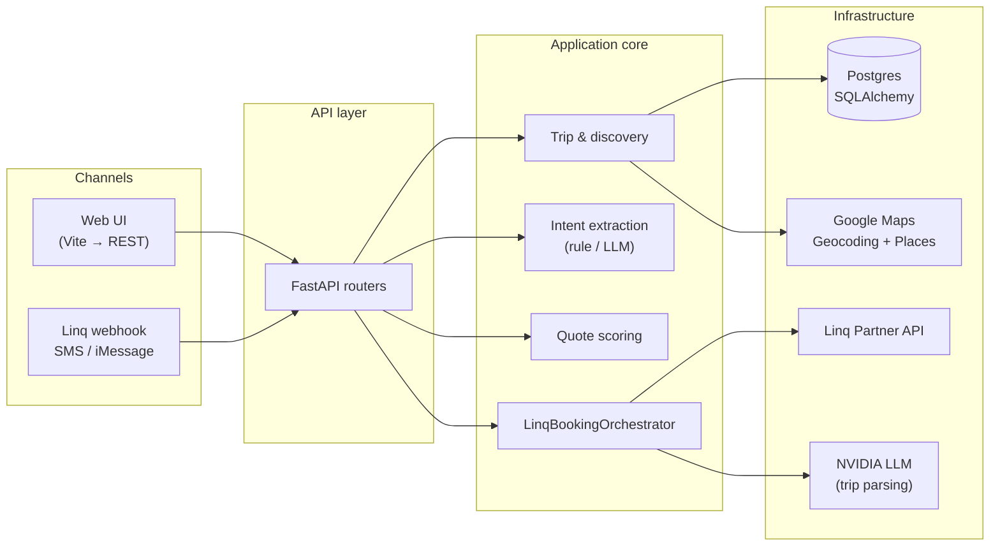

# Hotel Booking AI Agent

**Your trip, your thread—an AI concierge that turns “I need a room in Sedona next weekend” into ranked hotels, real quotes, and a clear path to book.**

This project is a **FastAPI** backend plus an optional **React (Vite)** UI. It collects trip intent (natural language or forms), discovers hotels (stub or **Google Places**), scores options, and guides users through **explicit approval** before any booking step.

**Linq** is the SMS / iMessage channel: **Linq** delivers each customer message to our app with a **signed `POST /webhooks/linq` webhook**; we verify the signature, **append messages per thread** for multi-turn trip building, run the same discovery and ranking logic as the web app, and send replies back through the **Linq Partner API** (outbound text to the user’s number). When hotels are listed, users **reply with a number** to pick an option; we respond with a **Booking.com** prefilled link. **LLM-backed** trip extraction (e.g. NVIDIA) is used for natural-language SMS when configured. You can use the **web UI** and **Linq** interchangeably against one backend.

---

## High-level design

### What it does (end-to-end)

1. **Capture intent** — Destination, dates, guests, and preferences arrive via the web app or threaded Linq messages.
2. **Normalize & persist** — Trip specs are stored; rule-based or LLM extraction fills gaps and merges follow-up messages in chat threads.
3. **Discover hotels** — Geocoding + Places Text Search (or a stub provider) produces candidates within a configurable radius.
4. **Quote & rank** — Quotes and scoring prepare comparable options (live hotel calling can be wired via ports; this build emphasizes discovery + links).
5. **Human-in-the-loop** — Users approve choices before booking-related actions; the API enforces this with clear errors when approval is missing.
6. **Finish** — **Booking.com** search URLs (optional affiliate id) or demo booking records close the loop; Linq users pick hotels by number and receive prefilled links.



### Layered architecture

| Layer | Role |
| --- | --- |
| **`app/domain/`** | Exceptions, workflow state, **ports** (`IntentParserPort`, `HotelOutboundPort`, `ChannelMessagingPort`, `SpeechTranscriptionPort`), and pure messaging helpers (phases, hotel pick resolution). |
| **`app/application/`** | Use cases: `TripService`, `HotelDiscoveryService`, `CallSessionService`, `DecisionService`, booking/consent flows, **`LinqBookingOrchestrator`** for inbound Linq, **`QuoteScorer`**, **`RuleBasedIntentParser`**. |
| **`app/infrastructure/`** | SQLAlchemy **repositories**, **audit logging**, **Linq** adapters, **Google Hotels** client, optional **AI** (NVIDIA, Hugging Face speech). |
| **`app/api/`** | Thin HTTP adapters, schemas, **mappers**; **`app/core/app_factory.py`** wires CORS, idempotency on POSTs, static UI, and exception mapping. |
| **`web/src/`** | Shared HTTP client, hooks, and **`features/booking/`** for the main UI flow. |

Ports keep integrations swappable (e.g. another SMS provider or a simulated hotel caller) without rewriting business logic.

---

## Build & run

**Prerequisites:** Python 3.11+, Node 18+ (for the web UI), Docker optional (Postgres).

### Backend — install dependencies

From the repo root (`hotel-booking-agent`):

```bash
python -m venv .venv
```

Activate the virtual environment:

```bash
# Linux / macOS
source .venv/bin/activate

# Windows PowerShell
.\.venv\Scripts\Activate.ps1
```

```bash
pip install -r requirements.txt
copy .env.example .env
# Linux / macOS: cp .env.example .env
```

Edit `.env` if needed. `DATABASE_URL` defaults to **localhost:5433** for this app’s Postgres so it does not conflict with another instance on **5432**.

### Backend — database (optional)

If you do not already have Postgres:

```bash
docker run --name hotel-agent-postgres -e POSTGRES_PASSWORD=postgres -e POSTGRES_USER=postgres -e POSTGRES_DB=hotel_agent -p 5433:5432 -d postgres:16
```

### Backend — run the API

```bash
uvicorn app.main:app --reload
```

- API + Swagger: **http://127.0.0.1:8000/docs**
- Without a built UI bundle, `/` may 404 JSON unless you build the frontend (see below).

### Frontend — development (two terminals)

**Terminal 1 — API** (same as above):

```bash
uvicorn app.main:app --reload
```

**Terminal 2 — Vite dev server:**

```bash
cd web
npm install
npm run dev
```

Open **http://127.0.0.1:5173** (proxies API calls to port 8000).

### Frontend — production build (single process)

Build static assets, then serve them from FastAPI:

```bash
cd web
npm install
npm run build
cd ..
uvicorn app.main:app --reload
```

Open **http://127.0.0.1:8000/** for the UI, or **http://127.0.0.1:8000/docs** for Swagger.

### Frontend — preview built assets only (optional)

After `npm run build`, you can sanity-check the bundle without Python:

```bash
cd web
npm run preview
```

---

## Notes

### Hotel search (Google)

- `HOTEL_DISCOVERY_PROVIDER=stub` uses seeded fake hotels. `google` calls Geocoding API + Places API **(New)** Text Search (`places.googleapis.com`). Keys from the [Maps Platform key onboarding](https://console.cloud.google.com/google/maps-apis/onboard;flow=gmp-api-key-flow) often enable **Maps JavaScript** first; you must still open **APIs & Services → Library** and enable **Places API (New)** separately, then under **Credentials → your key → API restrictions**, either allow **Places API (New)** (and Geocoding) or use no restriction for local dev. Billing must be linked. Vague destinations (e.g. `Page`) may geocode poorly—prefer `Page, AZ`. On 403, check the API response detail in server logs (the app surfaces Google’s error message).
- **Proximity:** By default, results are limited to **`HOTEL_SEARCH_RADIUS_MILES`** (default **10**) miles from the geocoded trip destination, or from a **reference location** if the LLM adds one on the trip. Text Search uses a circular **`locationBias`** (Google’s Text Search API does not allow a circle on `locationRestriction`); we **filter by distance** in code so results stay within the radius. **`HOTEL_SEARCH_MAX_RESULTS`** (default **4**) caps how many hotels are stored and returned; stub quotes show **nightly + taxes + total** next to each hotel in the UI and Linq SMS.

### Linq (SMS / iMessage) — how this differs from the web UI

The **web UI** (`npm run dev` or built `/`) talks to the same backend over REST. **Linq** uses **inbound messages**: there is no separate “Linq portal” to pick hotels—the **SMS/iMessage thread is the UI**.

- **`LINQ_FROM_NUMBER`** is the **business / sender** identity your integration uses for **outbound** replies (and to filter echo traffic). **Customers text *to* the Linq number assigned to your product/inbox in the Linq dashboard**, not “from” this env var. Inbound webhooks carry the **customer’s** number as the sender.

1. **Configure `.env`:** `LINQ_API_KEY` (Partner API token), `LINQ_FROM_NUMBER` (E.164 sender your API uses when sending replies), `LINQ_WEBHOOK_SECRET` (from Linq so `POST /webhooks/linq` can verify signatures). For natural-language trips over SMS, set **`NVIDIA_API_KEY`** (the Linq flow uses the LLM extractor; without it users see a short “needs NVIDIA_API_KEY” reply). Set **`HOTEL_DISCOVERY_PROVIDER=google`** and **`GOOGLE_MAPS_API_KEY`** if you want real Places results, same as the web app.
2. **Expose the webhook:** Linq must reach your server at **`POST /webhooks/linq`**. On your machine, run **`ngrok http 8000`** (or similar) and copy the public **HTTPS** base URL.
3. **Linq dashboard:** In your [Linq webhooks / subscriptions](https://docs.linqapp.com/guides/webhooks/index.md) settings, add a subscription whose URL is **`https://<your-host>/webhooks/linq`** and paste the signing secret into `LINQ_WEBHOOK_SECRET`.
   - **Messages visible in Linq but nothing in your API terminal?** Linq has delivered SMS on their side; they have **not** successfully **POST**ed to your app. Fix the **subscription URL** (must be **HTTPS**, publicly reachable—ngrok URL changes every run unless you use a reserved domain), confirm **`uvicorn`** is listening on the port ngrok forwards to, and reopen ngrok’s web UI (**127.0.0.1:4040**) to see whether inbound HTTP hits appear. After restart you should see log lines like `linq webhook: POST received` on each delivery.
4. **Multi-turn conversation:** Each inbound message is **appended** to a short thread buffer for that chat. The LLM sees the **combined** text so the user can send destination first, then dates, then guest count, etc. If **destination** or **check-in / check-out** is still missing, the bot asks the next question instead of running hotel search. **After a trip is complete** (hotels listed), the user replies **`1`**, **`2`**, … to pick a hotel and receives the **Booking.com** prefilled link. To **start another booking** in the same thread after completion, send **`new trip`**, **`start over`**, **`restart`**, **`book again`**, or **`another trip`** (optionally followed by the new details on the same line).

Voice notes and simulated hotel calls are off in this build; everything is text-in → text-out on Linq.

### Booking.com & approvals

- **Booking.com link:** Optional **`BOOKING_COM_AFFILIATE_ID`** (Partner Programme `aid=`) in `.env`. The UI and `GET /trip/{trip_id}/payment-link` return a `booking.com/searchresults.html` URL built from the trip and selected hotel; the guest completes payment on Booking.com.
- **`Create booking` in the web UI** persists a **demo `BookingRecord`** (`status` **`attempted`**) after quote approval. There is **no** integration that receives a real hotel confirmation / PNR from Booking.com or a CRS—`confirmation_number` stays empty and `final_terms` is typically `{}`. That is expected for this repo unless you add a supplier integration.

- Booking records from the web demo still require explicit approval before `POST /booking/create` unless you change that workflow.
