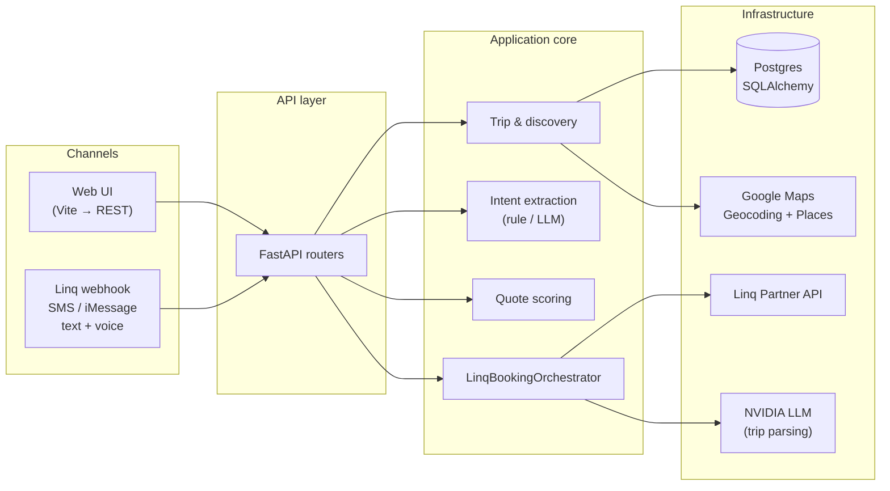

# Hotel Booking AI Agent

**Your trip, your thread—an AI concierge that turns “I need a room in Sedona next weekend” into ranked hotels, real quotes, and a clear path to book.**

This project is a **FastAPI** backend plus an optional **React (Vite)** UI. It collects trip intent (natural language or forms), discovers hotels (stub or **Google Places**), scores options, and guides users through **explicit approval** before any booking step.

**Linq** is the SMS / iMessage channel: **Linq** delivers each customer message to our app with a **signed `POST /webhooks/linq` webhook**; we verify the signature, **append messages per thread** for multi-turn trip building, run the same discovery and ranking logic as the web app, and send replies back through the **Linq Partner API** (outbound text to the user’s number). When hotels are listed, users **reply with a number** to pick an option; we respond with a **Booking.com** prefilled link. **LLM-backed** trip extraction (e.g. NVIDIA) is used for natural-language SMS when configured. You can use the **web UI** and **Linq** interchangeably against one backend.

---

## High-level design

Trip intent can arrive as **typed text or voice** (SMS/iMessage voice memos on Linq, mic upload on the web UI). Voice is transcribed first—**Deepgram** when configured—then merged with any text and handled by the same extraction and hotel-search pipeline.

### What it does (end-to-end)

1. **Capture intent** — Destination, dates, guests, and preferences arrive via the web app (form or mic) or threaded Linq messages (**text or voice notes**).
2. **Normalize & persist** — Trip specs are stored; rule-based or LLM extraction fills gaps and merges follow-up messages in chat threads.
3. **Discover hotels** — Geocoding + Places Text Search (or a stub provider) produces candidates within a configurable radius.
4. **Quote & rank** — Quotes and scoring prepare comparable options (live hotel calling can be wired via ports; this build emphasizes discovery + links).
5. **Human-in-the-loop** — Users approve choices before booking-related actions; the API enforces this with clear errors when approval is missing.
6. **Finish** — **Booking.com** search URLs (optional affiliate id) or demo booking records close the loop; Linq users pick hotels by number and receive prefilled links.



### Code layout

Rough split — nothing fancy:

| Path | What's in it |
| --- | --- |
| `app/api/` | FastAPI routes + Pydantic schemas. `deps.py` wires services for DI. |
| `app/application/` | Business logic: trips, hotel search, Linq SMS flow (`linq_booking_orchestrator.py`), booking. |
| `app/infrastructure/` | DB repos, Linq client, Google Places, NVIDIA/Deepgram/HF clients. |
| `app/domain/` | Small shared types: exceptions, a few protocols in `ports.py`, SMS phase enum. |
| `app/core/` | Settings, DB session, app factory. |
| `web/src/` | React UI. |

**Web:** form + optional keyword intent parse (`RuleBasedIntentParser`).  
**Linq:** multi-turn SMS → NVIDIA extracts trip JSON → same `HotelDiscoveryService` as web → user replies `1`/`2`/… → Booking.com link. Voice notes go through Deepgram first, then the same text path.

Hotel search is either stub names or Google Places (`HOTEL_DISCOVERY_PROVIDER`), controlled in `hotel_discovery_service.py`. We didn't add a full domain layer on top of SQLAlchemy — models are the source of truth for now.

---

## Build & run

**Prerequisites:** Python 3.11+, Node 18+ (for the web UI), Docker optional (Postgres).

### Backend — install dependencies

From the repo root (`hotel-booking-agent`):

```bash
python -m venv .venv
```

Activate the virtual environment:

```bash
# Linux / macOS
source .venv/bin/activate

# Windows PowerShell
.\.venv\Scripts\Activate.ps1
```

```bash
pip install -r requirements.txt
copy .env.example .env
# Linux / macOS: cp .env.example .env
```

Edit `.env` if needed. `DATABASE_URL` defaults to **localhost:5433** for this app’s Postgres so it does not conflict with another instance on **5432**.

### Backend — database (optional)

If you do not already have Postgres:

```bash
docker run --name hotel-agent-postgres -e POSTGRES_PASSWORD=postgres -e POSTGRES_USER=postgres -e POSTGRES_DB=hotel_agent -p 5433:5432 -d postgres:16
```

### Backend — run the API

```bash
uvicorn app.main:app --reload
```

- API + Swagger: **http://127.0.0.1:8000/docs**
- Without a built UI bundle, `/` may 404 JSON unless you build the frontend (see below).

### Frontend — development (two terminals)

**Terminal 1 — API** (same as above):

```bash
uvicorn app.main:app --reload
```

**Terminal 2 — Vite dev server:**

```bash
cd web
npm install
npm run dev
```

Open **http://127.0.0.1:5173** (proxies API calls to port 8000).

### Frontend — production build (single process)

Build static assets, then serve them from FastAPI:

```bash
cd web
npm install
npm run build
cd ..
uvicorn app.main:app --reload
```

Open **http://127.0.0.1:8000/** for the UI, or **http://127.0.0.1:8000/docs** for Swagger.

### Frontend — preview built assets only (optional)

After `npm run build`, you can sanity-check the bundle without Python:

```bash
cd web
npm run preview
```

---

## Notes

### Hotel search (Google)

- **`HOTEL_DISCOVERY_PROVIDER=stub`** — demo hotel names and stub prices only.
- **`google`** — Google Geocoding + Places Text Search. Lists nearby properties; users finish on **Booking.com** via prefilled search links (optional `BOOKING_COM_AFFILIATE_ID`).
- Enable **Places API (New)** + **Geocoding**, billing on. **`HOTEL_SEARCH_RADIUS_MILES`** (default **10**) and **`HOTEL_SEARCH_MAX_RESULTS`** (default **4**) cap results.

### Linq (SMS / iMessage) — how this differs from the web UI

The **web UI** talks to your laptop over REST. **Linq does not** — their servers must call your app on the public internet.

**`uvicorn` alone is not enough.** If you only run `uvicorn app.main:app --reload`, texting your Linq number will not hit your app until you expose port 8000 (e.g. ngrok) and register that URL in the Linq dashboard.

**Checklist**

1. **`.env`:** `LINQ_API_KEY`, `LINQ_FROM_NUMBER` (E.164 you send *from*), `LINQ_WEBHOOK_SECRET` (from the webhook subscription), `NVIDIA_API_KEY` (trip parsing). Optional: `DEEPGRAM_API_KEY` for voice notes.
2. **Postgres running** + migrations applied (`alembic upgrade head`).
3. **Terminal 1:** `uvicorn app.main:app --reload`
4. **Terminal 2:** `ngrok http 8000` → copy the `https://….ngrok-free.app` URL
5. **Linq dashboard:** webhook subscription → `https://<ngrok-host>/webhooks/linq` (same secret as `LINQ_WEBHOOK_SECRET`)
6. **Sanity check:** open `http://127.0.0.1:8000/webhooks/linq/health` — `can_send_replies` should be `true`
7. **Text your Linq number** — the uvicorn terminal should log `linq webhook hit` on every message. If you never see that line, Linq is not reaching your machine (wrong URL, ngrok stopped, or signature 401).

- **`LINQ_FROM_NUMBER`** = outbound sender. Customers text the number assigned in Linq’s UI, not this env var.
4. **Multi-turn conversation:** Each inbound message is **appended** to a short thread buffer for that chat. The LLM sees the **combined** text so the user can send destination first, then dates, then guest count, etc. If **destination** or **check-in / check-out** is still missing, the bot asks the next question instead of running hotel search. **After a trip is complete** (hotels listed), the user replies **`1`**, **`2`**, … to pick a hotel and receives the **Booking.com** prefilled link. To **start another booking** in the same thread after completion, send **`new trip`**, **`start over`**, **`restart`**, **`book again`**, or **`another trip`** (optionally followed by the new details on the same line).

**Voice notes on Linq:** When a message includes audio attachments, the server transcribes them with **Deepgram** (`DEEPGRAM_API_KEY`, pre-recorded `POST /v1/listen`) and merges the transcript with any typed text. That combined string then follows the same LLM trip-extraction and hotel-search pipeline as plain SMS. The web mic (`POST /ai/transcribe`) also prefers Deepgram when configured. Simulated outbound hotel calls remain optional/off by default.

### Booking.com & approvals

- **Booking.com link:** Optional **`BOOKING_COM_AFFILIATE_ID`** (Partner Programme `aid=`) in `.env`. The UI and `GET /trip/{trip_id}/payment-link` return a `booking.com/searchresults.html` URL built from the trip and selected hotel; the guest completes payment on Booking.com.
- **`Create booking` in the web UI** persists a **demo `BookingRecord`** (`status` **`attempted`**) after quote approval. There is **no** integration that receives a real hotel confirmation / PNR from Booking.com or a CRS—`confirmation_number` stays empty and `final_terms` is typically `{}`. That is expected for this repo unless you add a supplier integration.

- Booking records from the web demo still require explicit approval before `POST /booking/create` unless you change that workflow.
